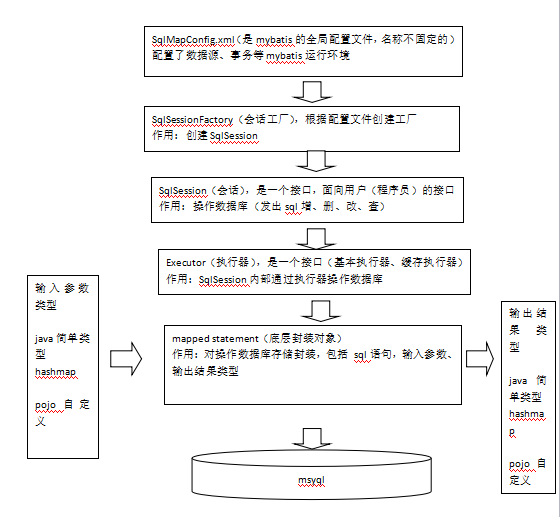

# mybatis框架

## 1 mybatis是什么

​	mybatis是一个持久层的框架，是apache下的顶级项目。

​	mybatis让程序将主要精力放在sql上，通过mybatis提供的映射方式，自由灵活生成（半自动化，大部分需要程序员编写sql）满足需要sql语句。

​	mybatis可以将向 preparedStatement中的输入参数自动进行输入映射，将查询结果集灵活映射成java对象。


## 2 mybatis框架原理

<div align=center>
   
</div>


## 3 示例入门程序（mapper接口模式）

### 3.1 示例程序需求

- 根据学生id（主键）查询用户信息
- 根据学生名称模糊查询用户信息
- 添加学生
- 删除学生
- 修改学生

### 3.2 示例程序结构

<div align=center>
   
</div>


### 3.3 详细说明

1. 创建web项目，导入所需的jar包：

<div align=center>
   
</div>

1. 创建所需的包结构及所需文件
   <div align=center>
   
   </div>

   1. 在src目录下创建SqlMapConfig.xml文件，文件内容如下：

      ```xml
      <?xml version="1.0" encoding="UTF-8"?>
      <!DOCTYPE configuration
              PUBLIC "-//mybatis.org//DTD Config 3.0//EN"
              "http://mybatis.org/dtd/mybatis-3-config.dtd">
      <configuration>
          <!-- 和spring整合后 environments配置将废除-->
          <environments default="development">
              <environment id="development">
                  <!-- 使用jdbc事务管理-->
                  <transactionManager type="JDBC" />
                  <!-- 数据库连接池-->
                  <dataSource type="POOLED">
                      <property name="driver" value="com.mysql.jdbc.Driver" />
                      <property name="url" value="jdbc:mysql://localhost:3306/Student?useSSL=false" />
                      <property name="username" value="root" />
                      <property name="password" value="SakuraF1996313" />
                  </dataSource>
              </environment>
          </environments>
          <mappers>
              <!--
              批量加载mapper，遵循的规范：
              1.使用mapper接口方式
              2.mapper接口及其对应的mapper.xml文件在同一目录且名称一致
               -->
              <package name="me.syaokyo.mapper"/>
          </mappers>
      </configuration>
      ```

   2. 在entity目录下创建Student实体类，内容如下：

      ```java
      package me.syaokyo.entity;
      
      /**
       * Created by SyaoKyo on 2018/9/4.
       */
      public class Student {
      
          private String stuNo;
          private String stuName;
          private String stuSex;
          private int stuAge;
      
          public Student(String stuNo, String stuName, String stuSex, int stuAge) {
              this.stuNo = stuNo;
              this.stuName = stuName;
              this.stuSex = stuSex;
              this.stuAge = stuAge;
          }
      
          public Student() {
          }
      
          public String getStuNo() {
              return stuNo;
          }
      
          public void setStuNo(String stuNo) {
              this.stuNo = stuNo;
          }
      
          public String getStuName() {
              return stuName;
          }
      
          public void setStuName(String stuName) {
              this.stuName = stuName;
          }
      
          public String getStuSex() {
              return stuSex;
          }
      
          public void setStuSex(String stuSex) {
              this.stuSex = stuSex;
          }
      
          public int getStuAge() {
              return stuAge;
          }
      
          public void setStuAge(int stuAge) {
              this.stuAge = stuAge;
          }
      }
      ```

   3. 在mapper包下创建StudentMapper.xml映射文件，内容如下：

      **这里注意要将StudentMapper.xml文件添加到SqlMapConfig.xml文件中（上面的SqlMapConfig.xml文件中已经添加好了）**

      ```xml
      <?xml version="1.0" encoding="UTF-8"?>
      <!DOCTYPE mapper
              PUBLIC "-//mybatis.org//DTD Mapper 3.0//EN"
              "http://mybatis.org/dtd/mybatis-3-mapper.dtd">
      <!-- 这里的namespace是mapper接口的路径 -->
      <mapper namespace="me.syaokyo.mapper.StudentMapper">
          <select id="selectStuById" parameterType="java.lang.String" resultType="me.syaokyo.entity.Student">
              select * from studentInfo where stuNo=#{aaa}
          </select>
          <select id="selectByFirstName" parameterType="java.lang.String" resultType="me.syaokyo.entity.Student">
              select * from studentInfo where stuName like '${value}%'
          </select>
          <insert id="addStudent" parameterType="me.syaokyo.entity.Student">
              insert into studentInfo values(#{stuNo},#{stuName},#{stuSex},#{stuAge})
          </insert>
          <delete id="deleteStudentById" parameterType="java.lang.String">
              delete from studentInfo where stuNo=#{stuNo}
          </delete>
          <update id="updateStudentById" parameterType="me.syaokyo.entity.Student">
              update studentInfo set stuName=#{stuName},stuSex=#{stuSex},stuAge=#{stuAge} where stuNo=#{stuNo}
          </update>
      </mapper>
      ```

   4. 在mapper包下创建StudentMapper.java接口文件，内容如下：

      **这个接口要符合一定的规范：**

      - **在mapper.xml中namespace等于mapper接口地址**

      - **mapper.java接口中的方法名和mapper.xml中statement的id一致**

      - **mapper.java接口中的方法输入参数类型和mapper.xml中statement的parameterType指定的类型一致。**

      - **mapper.java接口中的方法返回值类型和mapper.xml中statement的resultType指定的类型一致。**

        请根据以上规范编写的StudentMapper！

      ```java
      package me.syaokyo.mapper;
      
      import me.syaokyo.entity.Student;
      
      import java.util.List;
      
      /**
       * Created by SyaoKyo on 2018/9/4.
       */
      public interface StudentMapper {
      
          Student selectStuById(String stuNo);
      
          List<Student> selectByFirstName(String firstName);
      
          void addStudent(Student s);
      
          void deleteStudentById(String stuNo);
      
          void updateStudentById(Student s);
      }
      ```

   5. 最后为了验证程序是否能运行，还要测试一下，创建testMode.java ：

      ```java
      package me.syaokyo.test;
      
      import me.syaokyo.entity.Student;
      import me.syaokyo.mapper.StudentMapper;
      import org.apache.ibatis.io.Resources;
      import org.apache.ibatis.session.SqlSession;
      import org.apache.ibatis.session.SqlSessionFactory;
      import org.apache.ibatis.session.SqlSessionFactoryBuilder;
      
      import java.io.IOException;
      import java.io.InputStream;
      import java.util.List;
      
      /**
       * Created by SyaoKyo on 2018/9/4.
       */
      public class TestMode {
          public static void main(String[] args) throws IOException {
      
              // 1.读取SqlMapConfig.xml配置文件
              String path = "SqlMapConfig.xml";
              InputStream in = Resources.getResourceAsStream(path);
              // 创建会话工厂
              SqlSessionFactory factory = new SqlSessionFactoryBuilder().build(in);
              // 获得会话
              SqlSession session = factory.openSession();
              //mybatis自动生成mapper代理对象
              StudentMapper sm = session.getMapper(StudentMapper.class);
      
              //selectStuById
              System.out.println(sm.selectStuById("201801010001").getStuName());
              System.out.println(sm.selectStuById("201801010002").getStuName());
              System.out.println("\nadd:");
      
              //addStudent
              Student s=new Student("201801010007","张白","男",18);
              sm.addStudent(s);
      
              List<Student> list1 = sm.selectByFirstName("张");
              int listSize = list1.size();
              for (int i=0;i<listSize;i++){
                  System.out.println(list1.get(i).getStuNo()+'\t'+
                          list1.get(i).getStuName()+ '\t'+
                          list1.get(i).getStuSex()+'\t'+
                          list1.get(i).getStuAge());
              }
              System.out.println("\ndelete:");
      
              //deleteStudent
              sm.deleteStudentById("201801010007");
      
              list1 = sm.selectByFirstName("张");
              listSize = list1.size();
              for (int i=0;i<listSize;i++){
                  System.out.println(list1.get(i).getStuNo()+'\t'+
                          list1.get(i).getStuName()+ '\t'+
                          list1.get(i).getStuSex()+'\t'+
                          list1.get(i).getStuAge());
              }
              System.out.println("\nupdate:");
      
              //updateStudent
              Student stu=new Student("201801010001","张三","女",17);
              sm.updateStudentById(stu);
      
              list1 = sm.selectByFirstName("张");
              listSize = list1.size();
              for (int i=0;i<listSize;i++){
                  System.out.println(list1.get(i).getStuNo()+'\t'+
                          list1.get(i).getStuName()+ '\t'+
                          list1.get(i).getStuSex()+'\t'+
                          list1.get(i).getStuAge());
              }
          }
      }
      ```

2. 在数据库中创建表

<div align=center>
   
</div>

1. 在表中添加数据

<div align=center>
   
</div>

## 4 运行结果

<div align=center>
   
</div>
​      


